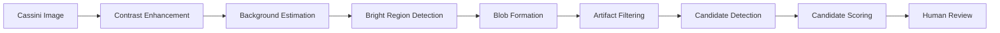

# Jupiter Lightning Detector: 2-Minute Overview

The detector is a classical image-processing pipeline. It finds unusually bright, multi-pixel regions in Cassini Jupiter images, removes obvious artifacts, ranks the remaining candidates, and then sends them to human review.

**Short version:** this is not a black-box AI model. It is a rule-based detector that measures brightness, local contrast, blob size, signal-to-noise ratio, shape, and artifact flags.

## Single-Page Pipeline

## What Happens At Every Stage

| Stage | Input: What goes in? | Process: What happens? | Output: What comes out? |
|---|---|---|---|
| Cassini Image | One calibrated Cassini ISS narrow-angle image. | Load the image array and valid-pixel mask. | A science image ready for measurement. |
| Contrast Enhancement | A faint nightside image. | Stretch brightness using robust percentiles. | Dim structure becomes easier to see. |
| Background Estimation | Enhanced image. | Smooth the image to estimate local background glow. | A background model for comparison. |
| Bright Region Detection | Image minus background, expressed as local SNR. | Mark pixels that are much brighter than local noise. | A map of bright pixels. |
| Blob Formation | Bright pixels. | Group touching bright pixels into connected regions. | Blobs with coordinates, size, and brightness. |
| Artifact Filtering | Measured blobs. | Flag single-pixel, tiny, sharp, streak-like, or border artifacts. | A cleaner set of possible signals. |
| Candidate Detection | Filtered blobs. | Keep blobs that are multi-pixel and above the SNR threshold. | Review candidates, not confirmed lightning. |
| Candidate Scoring | Candidates, and when available, nearby-frame links. | Rank by brightness, size, shape, and temporal consistency. | A ranked review list or possible track. |
| Human Review | Ranked candidates and image crops. | Compare against image context and published detections. | Accept, reject, or uncertain label. |

## Worked Example

Simplified trace using image **N1357029177**. The real full-frame run produces many review candidates; this example shows the decision logic for one known lightning region.

1. **Input image:** N1357029177.
2. **Step 1:** Brightness enhancement makes faint nightside blobs easier to see.
3. **Step 2:** Three nearby bright blobs are considered in this simplified view.
4. **Step 3:** Two are rejected as likely artifacts because they are too small, too sharp, or poorly shaped.
5. **Step 4:** One multi-pixel candidate remains.
6. **Step 5:** The remaining candidate is compared against the published lightning mark after detection.
7. **Result:** Match found. This validates that the detector can recover a known January 1 lightning location without being handed that coordinate first.

## How Does The Detector Decide?

- **Brightness:** Measures how bright the region is after the image is stretched.
- **Local contrast:** Checks whether the region is brighter than its nearby background.
- **Blob size:** Prefers multi-pixel regions over isolated single-pixel hits.
- **Signal-to-noise ratio:** Compares the signal strength to the local noise level.
- **Shape metrics:** Measures sharpness and elongation to separate diffuse blobs from spikes or streaks.
- **Artifact filters:** Rejects candidates that look like hot pixels, cosmic-ray hits, streaks, or edge effects.

## What Is NOT Happening?

- The detector is not given lightning coordinates during the scan; published coordinates are used afterward for validation.
- The detector is not manually told where lightning is; human review happens after candidates are generated.
- The detector is not using reinforcement learning.
- The detector is not yet a trained YOLO model or any other deep-learning object detector.
- The detector is not claiming every bright region is lightning; it is building a ranked review list.

## Current Status

- **Published detections validated:** Known January 1, January 10, and January 11 marks are recovered in detector outputs.
- **Candidate generation working:** The pipeline now produces review queues instead of only manual inspection images.
- **False-positive analysis in progress:** Many candidates are expected to be artifacts, so the review queue is not a confirmed lightning catalog.
- **Temporal review started:** The pipeline now exports temporal-track summaries and a first-pass review plan. The remaining scientific upgrade is validating those tracks with human review and geometry.
